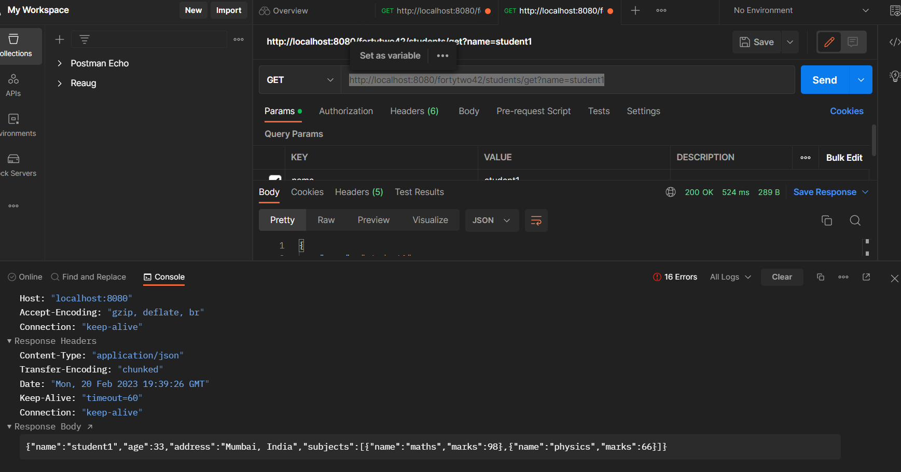

# Assignment fortytwo42
Simple Java App using Java Spring Boot

## Steps to run
1. Build the project using `mvn clean install`
2. Run junits using `mvn test`
2. Run using `mvn spring-boot:run`
3. The rest API is accessible via postman http://localhost:8080/fortytwo42/students/get?name=student1. 
     
4. H2 DB is accessible via http://localhost:8080/h2-console/
5. FYI Seed Data is being loaded to the DB from the data.sql file